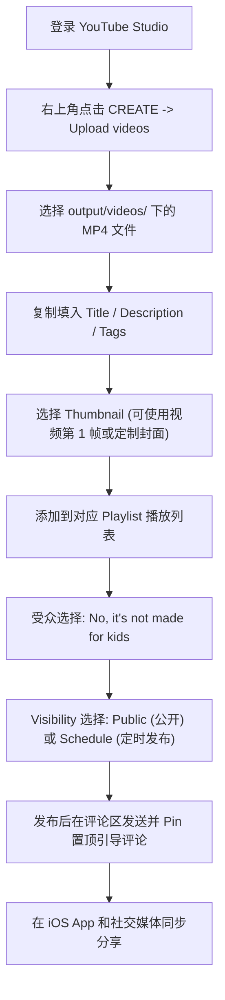

# 🚀 TokyoFlow Japanese • YouTube Channel Launch Kit
*(官方 YouTube 创作者上线与发布实操手册)*

---

## 📌 目录与快速导航
1. [第一步：YouTube 频道基础资料设置 (Channel Profile Setup)](#1-第一步youtube-频道基础资料设置)
2. [第二步：频道视觉资产配置 (Visual Assets Setup)](#2-第二步频道视觉资产配置)
3. [第三步：首发 3 支精选视频发布包 (First 3 Launch Videos)](#3-第三步首发-3-支精选视频发布包)
4. [第四步：播放列表创建与分类 (Playlists Setup)](#4-第四步播放列表创建与分类)
5. [第五步：社区首帖与置顶互动 (Community & Pinned Comments)](#5-第五步社区首帖与置顶互动)
6. [第六步：全流程上传操作步骤 (Step-by-Step Upload Walkthrough)](#6-第六步全流程上传操作步骤)

---

## 1. 第一步：YouTube 频道基础资料设置

> **中文操作提示**：
> 1. 打开 [YouTube Studio (studio.youtube.com)](https://studio.youtube.com/)。
> 2. 点击左侧菜单的 **「Customization (自定义)」** -> **「Basic info (基本信息)」**。
> 3. 复制并填入以下英文内容。

### 🏷️ Channel Name (频道名称)
```text
TokyoFlow Japanese
```

### 🆔 Handle (唯一用户名 / 网址短链)
```text
@TokyoFlowJapan
```
*(备选：`@TokyoFlowJP` 或 `@TokyoFlowLanguage`)*

### 📝 Channel Bio / Description (频道完整简介)
```text
Welcome to TokyoFlow Japanese 🎌 — Master real-life Tokyo Japanese through authentic scenarios, native train announcements, kombini survival drills, and NHK news shadowing.

💡 WHY TOKYOFLOW?
Traditional textbooks teach stiff, formal Japanese you rarely hear on Tokyo streets. TokyoFlow bridges the gap between textbook theory and real-life Tokyo fluency:
• 🚄 Authentic Metro & Yamanote Line announcements with furigana breakdowns.
• 🏪 1-second survival response phrases for 7-Eleven, FamilyMart & Lawson.
• 🍢 Izakaya ordering etiquette, sake culture & casual slang.
• 🎙️ NHK Easy Japanese news shadowing with pitch accent guidance.
• 🎯 JLPT N5 to N1 core vocabulary in context.

📱 COMPANION iOS APP:
Download 'TokyoFlow' on the Apple App Store for free interactive voice scoring, Kana drills, and intelligent SRS flashcards.

🔔 Subscribe for weekly Tokyo immersion lessons and level up your Japanese confidence!
#Japanese #LearnJapanese #Tokyo #JLPT #JapaneseListening #StudyJapanese
```

### 🌐 Links & Socials (频道外链配置)
- **Link Title 1**: `📱 Download Free iOS App (TokyoFlow)`
- **Link URL 1**: `https://apps.apple.com/app/tokyoflow` *(上线后填入 App Store 真实链接)*
- **Link Title 2**: `🎌 Official Website`
- **Link URL 2**: `https://tokyoflow.app`

---

## 2. 第二步：频道视觉资产配置

> **中文操作提示**：
> 1. 在 **YouTube Studio** -> **「Customization (自定义)」** -> **「Branding (品牌)」** 页面。
> 2. 上传头像（Profile picture）、横幅（Banner image）和视频水印（Video watermark）。
> 3. 本地资产文件位于项目的 `docs/youtube_assets/` 目录下。

| 资产类型 | 推荐尺寸 | 本地文件路径 | 效果说明 |
| :--- | :--- | :--- | :--- |
| **Profile Picture (头像)** | 800 x 800 px | `docs/youtube_assets/tokyoflow_official_app_icon.jpg` | 极简东京红白黑鸟居流动水滴设计，高辨识度 |
| **Banner Image (频道横幅)** | 2560 x 1440 px | `docs/youtube_assets/tokyoflow_channel_banner.jpg` | 东京天际线 + 鸟居 + 英文清晰标语，全端自适应居中 |
| **Video Watermark (视频右下角水印)** | 150 x 150 px | `docs/youtube_assets/tokyoflow_official_app_icon.jpg` | 设置为 "Entire video (整个视频)" 显示 |

---

## 3. 第三步：首发 3 支精选视频发布包

已渲染完成的 1080p 视频文件位于项目目录：[`output/videos/`](file:///Users/kilvonwu/Documents/UseCaseDrivenJapanese/output/videos)。

---

### 🎬 Video 1: 山手线与东京地铁广播
- **本地视频文件**: `output/videos/tokyoflow_v01_yamanote_transit.mp4`
- **时长**: 34秒 (精讲版) / 可切入 Shorts / Long-form

#### Title (视频标题)
```text
Tokyo Metro & Yamanote Line Platform Broadcasts | Real-Life Japanese Listening Drill
```

#### Description (视频简介)
```text
Decode authentic Tokyo train station announcements! In this lesson, we break down real Yamanote Line platform audio, polite safety warnings, and the #1 phrase to ask station staff for transfers.

⏱️ TIMESTAMPS:
0:00 - Approaching Train Announcement (まもなく、2番線に...)
0:10 - Platform Safety Warning (黄色い点字ブロックの内側まで...)
0:18 - Transfer Assistance Phrase (中央線への乗り換えは...)
0:24 - Shadowing Practice & iOS App Download

📌 KEY PHRASES COVERED:
1. まもなく、2番線に山手線内回りがまいります。
(The Yamanote Line inner loop train will arrive on Platform 2.)
2. 黄色い点字ブロックの内側までお下がりください。
(Please stand behind the yellow tactile warning blocks.)
3. すみません、中央線への乗り換えはどのホームですか？
(Excuse me, which platform is the transfer for the Chuo Line?)

📱 LEVEL UP WITH THE TOKYOFLOW APP:
Practice instant voice recognition & pitch accent on the TokyoFlow iOS app: https://tokyoflow.app

🔔 Subscribe to @TokyoFlowJapan for weekly real Tokyo scenarios!

#LearnJapanese #TokyoMetro #YamanoteLine #JapaneseListening #JapanesePhrases #JLPT
```

#### Tags (视频标签)
```text
japanese listening, learn japanese, tokyo metro, yamanote line, japanese train announcements, tokyo transit, japanese phrases, jlpt n5 listening, shadowing japanese, japanese pronunciation
```

---

### 🎬 Video 2: 日本便利店结账与微波炉加热
- **本地视频文件**: `output/videos/tokyoflow_v02_kombini_checkout.mp4`
- **时长**: 25秒

#### Title (视频标题)
```text
Japanese 7-Eleven & FamilyMart Checkout Mastery | 1-Second Kombini Survival Phrases
```

#### Description (视频简介)
```text
Never freeze at a Japanese convenience store register again! Master the 3 essential questions Tokyo 7-Eleven, FamilyMart, and Lawson cashiers ask you every single time.

⏱️ TIMESTAMPS:
0:00 - Bento Heating Question (お弁当温めますか？)
0:06 - Declining Plastic Bags (レジ袋は大丈夫です)
0:12 - Contactless Payment Selection (Suicaでお願いします)
0:18 - Review & TokyoFlow App Outro

📌 KEY PHRASES COVERED:
1. お弁当温めますか？ : 温めてください (Please heat it up) / 大丈夫です (No thanks)
2. レジ袋は大丈夫です。(No plastic bag needed, thank you.)
3. Suicaでお願いします。(I will pay with Suica, please.)

💡 PRO-TIP:
Pairing "大丈夫です (daijoubu desu)" with a subtle head nod is the most natural way to politely decline in Tokyo.

📱 Download TokyoFlow for free iOS practice: https://tokyoflow.app

#JapaneseConvenienceStore #7ElevenJapan #KombiniJapanese #StudyJapanese #JapaneseForTravel
```

#### Tags (视频标签)
```text
kombini japanese, 7 eleven japan, japanese checkout phrases, convenient store japanese, learn japanese for travel, tokyo 711, speak japanese, jlpt vocabulary, basic japanese
```

---

### 🎬 Video 3: 居酒屋地道点单与干杯礼仪
- **本地视频文件**: `output/videos/tokyoflow_v03_izakaya_night.mp4`
- **时长**: 26秒

#### Title (视频标题)
```text
Authentic Tokyo Izakaya Ordering & Etiquette | Japanese Dining Survival Guide
```

#### Description (视频简介)
```text
How to order like a Tokyo local at traditional Izakayas! Master the magic first-round beer phrase, yakitori seasoning choices, and getting your bill and receipt smoothly.

⏱️ TIMESTAMPS:
0:00 - The Golden First Drink Order (とりあえず生ビール二つ！)
0:06 - Yakitori Shio vs Tare (焼き鳥盛り合わせを塩で)
0:12 - The Check & Formal Receipt (お会計と領収書をお願いします)
0:18 - Practice & Community Challenge

📌 KEY PHRASES COVERED:
1. とりあえず生ビール二つお願いします！
(To start, two draft beers please!)
2. 焼き鳥盛り合わせを塩でお願いします。
(Assorted yakitori platter with salt seasoning, please.)
3. お会計と領収書をお願いします。
(The bill and formal receipt, please.)

🍻 CULTURAL NOTE:
"とりあえず (toriaezu)" means "for now / to start" — ordering drinks before food allows izakaya staff to serve your table quickly.

📱 Free TokyoFlow iOS App: https://tokyoflow.app

#Izakaya #JapaneseFood #OrderInJapanese #TravelJapan #JapaneseCulture #SpeakJapanese
```

#### Tags (视频标签)
```text
izakaya japanese, how to order in japan, tokyo izakaya, japanese food phrases, learn japanese, japanese dining etiquette, jlpt listening, nihongo
```

---

## 4. 第四步：播放列表创建、详细描述与封面设置 (Playlists Setup & Thumbnail Guide)

### 📋 4 大官方播放列表完整资料与英文描述 (Copy-and-Paste Descriptions)

---

#### 🚇 Playlist 1: Tokyo Transit & Station Japanese
- **Playlist Title**: `🚇 Tokyo Transit & Station Japanese`
- **Recommended Thumbnail**: `docs/youtube_assets/playlists/pl01_transit_metro_cover.jpg` (或 `EP.01` 封面)
- **Full English Description**:
```text
Master Tokyo's world-famous rail network with confidence! This playlist breaks down authentic automated train announcements, rush-hour station melodies, JR Yamanote Line broadcasts, and essential phrases to ask station clerks for transfers.

✨ WHAT YOU'LL LEARN:
• Understanding fast-paced Tokyo Metro & JR platform safety warnings
• Deciphering Keigo (humble & polite) verbs used in automated transit audio
• 1-second phrases to navigate Shinjuku, Shibuya & Tokyo Station hubs
• Ticket machine, IC card (Suica/Pasmo) recharge, and lost item inquiries

📱 Practice real-time voice shadowing with the free TokyoFlow iOS app: https://tokyoflow.app

#TokyoMetro #YamanoteLine #JapanTravel #LearnJapanese #JapaneseTransit #JLPTListening
```

---

#### 🏪 Playlist 2: Kombini & Street Survival Japanese
- **Playlist Title**: `🏪 Kombini & Street Survival Japanese`
- **Recommended Thumbnail**: `docs/youtube_assets/playlists/pl02_kombini_street_cover.jpg` (或 `EP.02` 封面)
- **Full English Description**:
```text
Never feel nervous at a Japanese convenience store register again! Master the essential rapid-fire dialogue you hear daily across Tokyo 7-Eleven, FamilyMart, Lawson, drugstores, and street vending machines.

✨ WHAT YOU'LL LEARN:
• 1-second natural responses to "Obentō atatamemasu ka?" (bento heating)
• Politely declining plastic bags, chopsticks, and receipts with natural intonation
• Specifying contactless payment methods (Suica, PayPay, Credit Card)
• Ordering hot fried chicken (Karaage-kun / Famichiki) and steamed buns at the counter

📱 Download TokyoFlow on the iOS App Store for interactive practice: https://tokyoflow.app

#7ElevenJapan #KombiniJapanese #TravelJapan #SpeakJapanese #JapanesePhrases #TokyoLife
```

---

#### 🍢 Playlist 3: Izakaya & Tokyo Foodie Japanese
- **Playlist Title**: `🍢 Izakaya & Tokyo Foodie Japanese`
- **Recommended Thumbnail**: `docs/youtube_assets/playlists/pl03_izakaya_dining_cover.jpg` (或 `EP.03` 封面)
- **Full English Description**:
```text
Dine like a true Tokyo local! From vibrant Omoide Yokocho izakayas to ramen counter shops and sushi bars, learn the exact phrases, dining etiquette, and drinking customs used across Tokyo nightlife.

✨ WHAT YOU'LL LEARN:
• The iconic first-drink formula ("Toriaezu nama!") and Otoshi appetizer customs
• Ordering yakitori skewers (Shio vs Tare sauce) and customized ramen noodle texture
• How to get your server's attention politely with "Sumimasen!"
• Settling the bill smoothly ("O-kaikei") and asking for tax receipts ("Ryōshūsho")

📱 Level up your food Japanese with the TokyoFlow iOS app: https://tokyoflow.app

#Izakaya #JapaneseFood #RamenJapanese #TokyoDining #OrderInJapanese #JapaneseCulture
```

---

#### 🎙️ Playlist 4: NHK Daily News & Shadowing Drills
- **Playlist Title**: `🎙️ NHK Daily News & Shadowing Drills`
- **Recommended Thumbnail**: `docs/youtube_assets/playlists/pl04_nhk_news_shadowing_cover.jpg`
- **Full English Description**:
```text
Bridge the gap to natural native listening speed! Train your ears with simplified NHK Easy Japanese daily news broadcasts, curated vocabulary, and millisecond-accurate audio shadowing drills.

✨ WHAT YOU'LL LEARN:
• Natural Tokyo pitch accent patterns (Heiban, Atamadaka, Nakadaka)
• High-frequency vocabulary for weather, travel trends, society, and technology
• Sentence-by-sentence shadowing drills to eliminate awkward speaking hesitation
• Ideal audio training for JLPT N4, N3, and N2 listening sections

📱 Pair with TokyoFlow iOS App for automated pronunciation accuracy scoring: https://tokyoflow.app

#NHKJapanese #JapaneseShadowing #JLPT #JapaneseListening #LearnJapanese #Nihongo
```

---

### 🛠️ YouTube 官方播放列表（Playlist）封面设置实操指引

> **⚠️ 必须了解的 YouTube 机制**：
> YouTube 并不像单集视频那样提供独立的“上传图片作为 Playlist 封面”按钮，而是**通过指定播放列表中的某支视频作为整个 Playlist 的封面（Thumbnail Source）**。

#### 📌 方法一：第一位视频自动继承法（最常用、最推荐）
1. 在 **YouTube Studio** -> **「Content (内容)」** -> **「Playlists (播放列表)」**。
2. 将对应分类的第 1 支核心视频（例如 `EP.01` 放入 Transit 列表，`EP.02` 放入 Kombini 列表，`EP.03` 放入 Izakaya 列表）。
3. 只要该视频本身已经上传了我们在 `docs/youtube_assets/thumbnails/` 中准备好的高清封面，**YouTube 就会自动将列表第 1 支视频的高清封面提取为该 Playlist 的整体封面**！
4. 确保在列表中将该视频**拖动到第 1 位（Top position）**即可。

#### 📌 方法二：在 YouTube 播放列表详情页手动指定封面
1. 打开 YouTube 网站（电脑浏览器），进入你的频道主页。
2. 点击 **「Playlists (播放列表)」** 标签页，点击进入你想修改的播放列表（点击播放列表标题下方的 **「View full playlist (查看完整播放列表)」**）。
3. 在视频列表右侧，找到你想作为封面的视频。
4. 点击该视频右侧的 **三点菜单 `⋮` (More options)**。
5. 在下拉菜单中点击 **「Set as playlist thumbnail (设为播放列表缩略图)」**。
6. 刷新页面，该播放列表的外部展示封面就会瞬间固定为你指定的高清封面！

---

## 5. 第五步：社区首帖与置顶互动 (Community & Pinned Comments)

### 📌 Pinned Comment Template (所有视频首条置顶评论模板)
在每个视频发布后，自己在评论区发送并**点击三点菜单选择「Pin (置顶)」**：

```text
🎌 What Tokyo scenario do you want us to cover next?
A) Ordering at Ichiran Ramen (オーダー用紙 paper customizer)
B) Akihabara Anime & Figure hunting phrases
C) Japanese Drugstore (Matsumoto Kiyoshi) shopping hacks
D) Tokyo Taxi & Airport Limousine Bus

Drop your vote in the comments below! 👇
And don't forget to practice today's audio drill in our free iOS companion app: https://tokyoflow.app
```

---

### 💬 Community Post 1 (频道发布第一条图文社区动态)
当频道具备社区功能或首周发布时使用：

```text
Konnichiwa everyone! 🌸 Welcome to the official TokyoFlow Japanese channel! 🎌

Our mission is to help you speak natural, authentic Tokyo Japanese with zero awkwardness. Whether you are prepping for your Tokyo trip, grinding for the JLPT, or mastering native listening, we've got you covered.

✨ What we are bringing you every week:
• Real-life scenario audio breakdowns (Train, Kombini, Izakaya, Anime shops)
• 1-second rapid survival phrases
• NHK News shadowing drills with native pitch accents

📱 Download our companion iOS App "TokyoFlow" on the App Store for interactive practice.

Hit subscribe, turn on notifications, and let us know: Where in Tokyo do you want to visit first? 🗼🚄
```

---

## 6. 第六步：全流程上传操作步骤

### 🛠️ 详细上传实操指引（图文对应）



#### 具体操作清单：
1. **上传视频文件**：
   - 打开 [studio.youtube.com](https://studio.youtube.com/)。
   - 点击右上角 **「CREATE (创建)」** -> **「Upload videos (上传视频)」**。
   - 拖拽 `output/videos/tokyoflow_v01_yamanote_transit.mp4` 开始上传。
2. **填写元数据 (Metadata)**：
   - 将上面第三部分准备好的 **Title** 和 **Description** 直接粘贴进去。
   - **Thumbnail (缩略图)**：选择视频自动生成的精美卡片帧，或上传定制封面。
   - **Playlists**：勾选对应的播放列表（例如 `Tokyo Transit & Station Japanese`）。
   - **Audience**：必须勾选 **「No, it's not made for kids」**（符合 COPPA 法规，以便开启评论区和通知铃铛）。
3. **Show More (高级设置)**：
   - 展开 **「Show more」**，将 **Tags** 标签粘贴到 Tags 框中。
   - **Video language** 选择 `Japanese`，**Title and description language** 选择 `English`。
4. **Visibility (发布可见性)**：
   - 选择 **Public (公开)**，或者建议选择 **Schedule (定时发布)**（例如设定在美东时间早 8 点 / 晚 8 点的流量高峰期）。
5. **置顶评论**：
   - 视频发布成功后，打开视频观看页，粘贴第五部分的 **Pinned Comment**，点击右侧三点菜单选择 **「Pin (置顶)」**。

---

*TokyoFlow Japanese — Created for global Japanese learners.* 🎌
