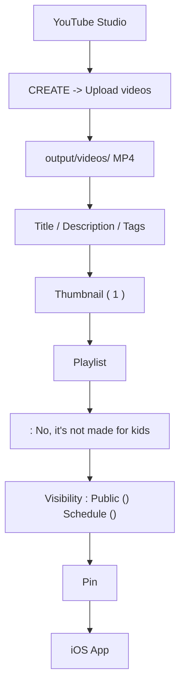

#  TokyoFlow Japanese • YouTube Channel Launch Kit
*( YouTube )*

---

##  
1. [YouTube  (Channel Profile Setup)](#1-youtube-)
2. [ (Visual Assets Setup)](#2-)
3. [ 3  (First 3 Launch Videos)](#3--3-)
4. [ (Playlists Setup)](#4-)
5. [ (Community & Pinned Comments)](#5-)
6. [ (Step-by-Step Upload Walkthrough)](#6-)

---

## 1. YouTube 

> ****
> 1.  [YouTube Studio (studio.youtube.com)](https://studio.youtube.com/)
> 2.  **Customization ()** -> **Basic info ()**
> 3. 

###  Channel Name ()
```text
TokyoFlow Japanese
```

###  Handle ( / )
```text
@TokyoFlowJapan
```
*(`@TokyoFlowJP`  `@TokyoFlowLanguage`)*

### Channel Bio / Description
```text
Welcome to TokyoFlow Japanese -- Master real-life Tokyo Japanese through authentic scenarios, native train announcements, kombini drills, and pop culture immersion.

WHY TOKYOFLOW?
Textbooks teach stiff Japanese rarely heard in Tokyo. TokyoFlow delivers real-world conversational fluency:
- Authentic Metro & Yamanote Line announcements with pitch accent.
- 1-second survival response formulas for 7-Eleven, FamilyMart & Lawson.
- Izakaya etiquette, casual spoken phrases, and cultural nuances.
- NHK Easy news shadowing and JLPT N5-N1 vocabulary in context.

PUBLISHING SCHEDULE:
- Daily Shorts: 8:00 AM
- Weekend Masterclass: Saturday & Sunday 8:00 AM

COMPANION iOS APP:
Download 'TokyoFlow' on the Apple App Store for voice scoring and smart SRS flashcards.

Subscribe to @TokyoFlowJapan for daily Tokyo immersion.

#Japanese #LearnJapanese #Tokyo #JLPT #JapaneseListening #StudyJapanese
```

###  Links & Socials ()
- **Link Title 1**: ` Download Free iOS App (TokyoFlow)`
- **Link URL 1**: `https://apps.apple.com/app/tokyoflow` *( App Store )*
- **Link Title 2**: ` Official Website`
- **Link URL 2**: `https://tokyoflow.app`

---

## 2. 

> ****
> 1.  **YouTube Studio** -> **Customization ()** -> **Branding ()** 
> 2. Profile pictureBanner imageVideo watermark
> 3.  `docs/youtube_assets/` 

|  |  |  |  |
| :--- | :--- | :--- | :--- |
| **Profile Picture ()** | 800 x 800 px | `docs/youtube_assets/tokyoflow_official_app_icon.jpg` |  |
| **Banner Image ()** | 2560 x 1440 px | `docs/youtube_assets/tokyoflow_channel_banner.jpg` |  +  +  |
| **Video Watermark ()** | 150 x 150 px | `docs/youtube_assets/tokyoflow_official_app_icon.jpg` |  "Entire video ()"  |

---

## 3.  3 

 1080p [`output/videos/`](file:///Users/kilvonwu/Documents/UseCaseDrivenJapanese/output/videos)

---

###  Video 1: 
- ****: `output/videos/tokyoflow_v01_yamanote_transit.mp4`
- ****: 34 () /  Shorts / Long-form

#### Title ()
```text
Tokyo Metro & Yamanote Line Platform Broadcasts | Real-Life Japanese Listening Drill
```

#### Description ()
```text
Decode authentic Tokyo train station announcements! In this lesson, we break down real Yamanote Line platform audio, polite safety warnings, and the #1 phrase to ask station staff for transfers.

⏱ TIMESTAMPS:
0:00 - Approaching Train Announcement (2...)
0:10 - Platform Safety Warning (...)
0:18 - Transfer Assistance Phrase (...)
0:24 - Shadowing Practice & iOS App Download

 KEY PHRASES COVERED:
1. 2
(The Yamanote Line inner loop train will arrive on Platform 2.)
2. 
(Please stand behind the yellow tactile warning blocks.)
3. 
(Excuse me, which platform is the transfer for the Chuo Line?)

 LEVEL UP WITH THE TOKYOFLOW APP:
Practice instant voice recognition & pitch accent on the TokyoFlow iOS app: https://tokyoflow.app

 Subscribe to @TokyoFlowJapan for weekly real Tokyo scenarios!

#LearnJapanese #TokyoMetro #YamanoteLine #JapaneseListening #JapanesePhrases #JLPT
```

#### Tags ()
```text
japanese listening, learn japanese, tokyo metro, yamanote line, japanese train announcements, tokyo transit, japanese phrases, jlpt n5 listening, shadowing japanese, japanese pronunciation
```

---

###  Video 2: 
- ****: `output/videos/tokyoflow_v02_kombini_checkout.mp4`
- ****: 25

#### Title ()
```text
Japanese 7-Eleven & FamilyMart Checkout Mastery | 1-Second Kombini Survival Phrases
```

#### Description ()
```text
Never freeze at a Japanese convenience store register again! Master the 3 essential questions Tokyo 7-Eleven, FamilyMart, and Lawson cashiers ask you every single time.

⏱ TIMESTAMPS:
0:00 - Bento Heating Question ()
0:06 - Declining Plastic Bags ()
0:12 - Contactless Payment Selection (Suica)
0:18 - Review & TokyoFlow App Outro

 KEY PHRASES COVERED:
1.  :  (Please heat it up) /  (No thanks)
2. (No plastic bag needed, thank you.)
3. Suica(I will pay with Suica, please.)

 PRO-TIP:
Pairing " (daijoubu desu)" with a subtle head nod is the most natural way to politely decline in Tokyo.

 Download TokyoFlow for free iOS practice: https://tokyoflow.app

#JapaneseConvenienceStore #7ElevenJapan #KombiniJapanese #StudyJapanese #JapaneseForTravel
```

#### Tags ()
```text
kombini japanese, 7 eleven japan, japanese checkout phrases, convenient store japanese, learn japanese for travel, tokyo 711, speak japanese, jlpt vocabulary, basic japanese
```

---

###  Video 3: 
- ****: `output/videos/tokyoflow_v03_izakaya_night.mp4`
- ****: 26

#### Title ()
```text
Authentic Tokyo Izakaya Ordering & Etiquette | Japanese Dining Survival Guide
```

#### Description ()
```text
How to order like a Tokyo local at traditional Izakayas! Master the magic first-round beer phrase, yakitori seasoning choices, and getting your bill and receipt smoothly.

⏱ TIMESTAMPS:
0:00 - The Golden First Drink Order ()
0:06 - Yakitori Shio vs Tare ()
0:12 - The Check & Formal Receipt ()
0:18 - Practice & Community Challenge

 KEY PHRASES COVERED:
1. 
(To start, two draft beers please!)
2. 
(Assorted yakitori platter with salt seasoning, please.)
3. 
(The bill and formal receipt, please.)

 CULTURAL NOTE:
" (toriaezu)" means "for now / to start" — ordering drinks before food allows izakaya staff to serve your table quickly.

 Free TokyoFlow iOS App: https://tokyoflow.app

#Izakaya #JapaneseFood #OrderInJapanese #TravelJapan #JapaneseCulture #SpeakJapanese
```

#### Tags ()
```text
izakaya japanese, how to order in japan, tokyo izakaya, japanese food phrases, learn japanese, japanese dining etiquette, jlpt listening, nihongo
```

---

## 4.  (Playlists Setup & Thumbnail Guide)

###  4  (Copy-and-Paste Descriptions)

---

####  Playlist 1: Tokyo Transit & Station Japanese
- **Playlist Title**: ` Tokyo Transit & Station Japanese`
- **Recommended Thumbnail**: `docs/youtube_assets/playlists/pl01_transit_metro_cover.jpg` ( `EP.01` )
- **Full English Description**:
```text
Master Tokyo's world-famous rail network with confidence! This playlist breaks down authentic automated train announcements, rush-hour station melodies, JR Yamanote Line broadcasts, and essential phrases to ask station clerks for transfers.

 WHAT YOU'LL LEARN:
• Understanding fast-paced Tokyo Metro & JR platform safety warnings
• Deciphering Keigo (humble & polite) verbs used in automated transit audio
• 1-second phrases to navigate Shinjuku, Shibuya & Tokyo Station hubs
• Ticket machine, IC card (Suica/Pasmo) recharge, and lost item inquiries

 Practice real-time voice shadowing with the free TokyoFlow iOS app: https://tokyoflow.app

#TokyoMetro #YamanoteLine #JapanTravel #LearnJapanese #JapaneseTransit #JLPTListening
```

---

####  Playlist 2: Kombini & Street Survival Japanese
- **Playlist Title**: ` Kombini & Street Survival Japanese`
- **Recommended Thumbnail**: `docs/youtube_assets/playlists/pl02_kombini_street_cover.jpg` ( `EP.02` )
- **Full English Description**:
```text
Never feel nervous at a Japanese convenience store register again! Master the essential rapid-fire dialogue you hear daily across Tokyo 7-Eleven, FamilyMart, Lawson, drugstores, and street vending machines.

 WHAT YOU'LL LEARN:
• 1-second natural responses to "Obentō atatamemasu ka?" (bento heating)
• Politely declining plastic bags, chopsticks, and receipts with natural intonation
• Specifying contactless payment methods (Suica, PayPay, Credit Card)
• Ordering hot fried chicken (Karaage-kun / Famichiki) and steamed buns at the counter

 Download TokyoFlow on the iOS App Store for interactive practice: https://tokyoflow.app

#7ElevenJapan #KombiniJapanese #TravelJapan #SpeakJapanese #JapanesePhrases #TokyoLife
```

---

####  Playlist 3: Izakaya & Tokyo Foodie Japanese
- **Playlist Title**: ` Izakaya & Tokyo Foodie Japanese`
- **Recommended Thumbnail**: `docs/youtube_assets/playlists/pl03_izakaya_dining_cover.jpg` ( `EP.03` )
- **Full English Description**:
```text
Dine like a true Tokyo local! From vibrant Omoide Yokocho izakayas to ramen counter shops and sushi bars, learn the exact phrases, dining etiquette, and drinking customs used across Tokyo nightlife.

 WHAT YOU'LL LEARN:
• The iconic first-drink formula ("Toriaezu nama!") and Otoshi appetizer customs
• Ordering yakitori skewers (Shio vs Tare sauce) and customized ramen noodle texture
• How to get your server's attention politely with "Sumimasen!"
• Settling the bill smoothly ("O-kaikei") and asking for tax receipts ("Ryōshūsho")

 Level up your food Japanese with the TokyoFlow iOS app: https://tokyoflow.app

#Izakaya #JapaneseFood #RamenJapanese #TokyoDining #OrderInJapanese #JapaneseCulture
```

---

####  Playlist 4: NHK Daily News & Shadowing Drills
- **Playlist Title**: ` NHK Daily News & Shadowing Drills`
- **Recommended Thumbnail**: `docs/youtube_assets/playlists/pl04_nhk_news_shadowing_cover.jpg`
- **Full English Description**:
```text
Bridge the gap to natural native listening speed! Train your ears with simplified NHK Easy Japanese daily news broadcasts, curated vocabulary, and millisecond-accurate audio shadowing drills.

 WHAT YOU'LL LEARN:
• Natural Tokyo pitch accent patterns (Heiban, Atamadaka, Nakadaka)
• High-frequency vocabulary for weather, travel trends, society, and technology
• Sentence-by-sentence shadowing drills to eliminate awkward speaking hesitation
• Ideal audio training for JLPT N4, N3, and N2 listening sections

 Pair with TokyoFlow iOS App for automated pronunciation accuracy scoring: https://tokyoflow.app

#NHKJapanese #JapaneseShadowing #JLPT #JapaneseListening #LearnJapanese #Nihongo
```

---

###  YouTube Playlist

> **  YouTube **
> YouTube “ Playlist ”** Playlist Thumbnail Source**

####  
1.  **YouTube Studio** -> **Content ()** -> **Playlists ()**
2.  1  `EP.01`  Transit `EP.02`  Kombini `EP.03`  Izakaya 
3.  `docs/youtube_assets/thumbnails/` **YouTube  1  Playlist **
4. ** 1 Top position**

####   YouTube 
1.  YouTube 
2.  **Playlists ()**  **View full playlist ()**
3. 
4.  ** `⋮` (More options)**
5.  **Set as playlist thumbnail ()**
6. 

---

## 5.  (Community & Pinned Comments)

###  Pinned Comment Template ()
**Pin ()**

```text
 What Tokyo scenario do you want us to cover next?
A) Ordering at Ichiran Ramen ( paper customizer)
B) Akihabara Anime & Figure hunting phrases
C) Japanese Drugstore (Matsumoto Kiyoshi) shopping hacks
D) Tokyo Taxi & Airport Limousine Bus

Drop your vote in the comments below! 
And don't forget to practice today's audio drill in our free iOS companion app: https://tokyoflow.app
```

---

###  Community Post 1 ()


```text
Konnichiwa everyone!  Welcome to the official TokyoFlow Japanese channel! 

Our mission is to help you speak natural, authentic Tokyo Japanese with zero awkwardness. Whether you are prepping for your Tokyo trip, grinding for the JLPT, or mastering native listening, we've got you covered.

 What we are bringing you every week:
• Real-life scenario audio breakdowns (Train, Kombini, Izakaya, Anime shops)
• 1-second rapid survival phrases
• NHK News shadowing drills with native pitch accents

 Download our companion iOS App "TokyoFlow" on the App Store for interactive practice.

Hit subscribe, turn on notifications, and let us know: Where in Tokyo do you want to visit first? 
```

---

## 6. 

###  



#### 
1. ****
   -  [studio.youtube.com](https://studio.youtube.com/)
   -  **CREATE ()** -> **Upload videos ()**
   -  `output/videos/tokyoflow_v01_yamanote_transit.mp4` 
2. ** (Metadata)**
   -  **Title**  **Description** 
   - **Thumbnail ()**
   - **Playlists** `Tokyo Transit & Station Japanese`
   - **Audience** **No, it's not made for kids** COPPA 
3. **Show More ()**
   -  **Show more** **Tags**  Tags 
   - **Video language**  `Japanese`**Title and description language**  `English`
4. **Visibility ()**
   -  **Public ()** **Schedule ()** 8  /  8 
5. ****
   -  **Pinned Comment** **Pin ()**

---

*TokyoFlow Japanese — Created for global Japanese learners.* 
